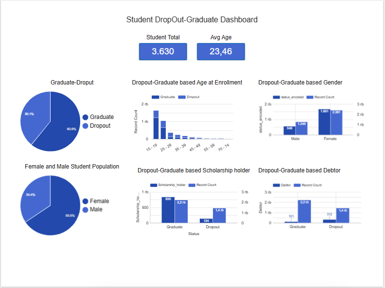
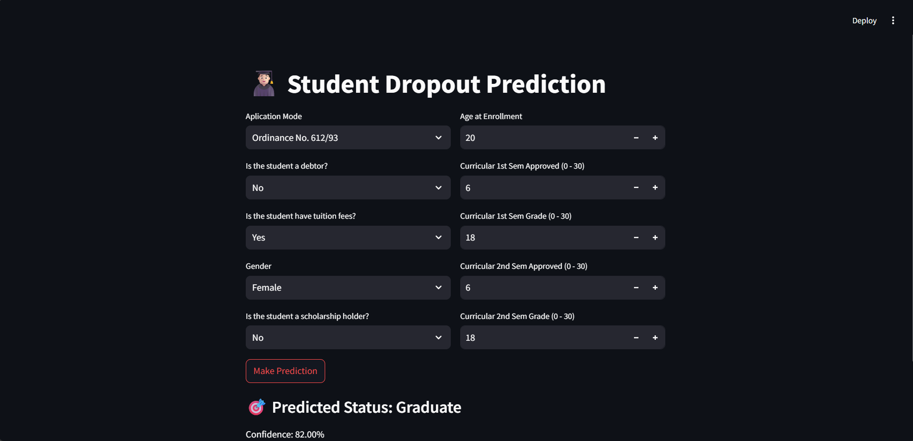

# Proyek Akhir: Menjawab Tantangan Perusahaan Edutech

---

## **Konteks Bisnis**

### **Latar Belakang**

Jaya Jaya Institut, sebuah institusi pendidikan tinggi terkemuka sejak tahun 2000, dikenal sebagai penghasil lulusan berkualitas tinggi. Namun, meskipun memiliki reputasi yang kuat, institusi ini tengah menghadapi permasalahan serius: **tingginya angka mahasiswa yang putus studi (dropout)**. Banyak mahasiswa yang tidak menyelesaikan pendidikan mereka, sehingga berdampak pada aspek akademik maupun keuangan institusi.

Untuk mengatasi hal ini, Jaya Jaya Institut berupaya memanfaatkan **Machine Learning** dan **Business Intelligence** guna **mengidentifikasi mahasiswa yang berisiko putus studi**. Dengan analisis prediktif, institusi dapat melakukan **intervensi dini** yang disesuaikan untuk mendukung dan membimbing mahasiswa tersebut.

### **Tantangan Bisnis**

1. **Tingginya Angka Dropout**
    Meskipun institusi memiliki reputasi yang baik, banyak mahasiswa yang keluar setelah semester pertama atau kedua, sehingga mengurangi jumlah lulusan dan memengaruhi budaya akademik serta kesehatan finansial institusi.

2. **Tidak Ada Sistem Peringatan Dini**
    Saat ini belum ada mekanisme untuk menandai mahasiswa yang berpotensi putus studi, sehingga peluang untuk memberikan dukungan tepat waktu sering terlewatkan.

3. **Minim Insight Berbasis Data**
    Institusi belum memiliki visibilitas berbasis data yang komprehensif terkait keterlibatan dan performa mahasiswa, sehingga sulit untuk mendeteksi tren atau masalah sebelum menjadi besar.

### **Ruang Lingkup Proyek**

Proyek ini mencakup:
* **Akuisisi Data**: Mengumpulkan data internal dari Jaya Jaya Institut, termasuk demografi mahasiswa, catatan akademik, dan latar belakang sosial ekonomi.
* **Eksplorasi Data**: Menganalisis dataset untuk menemukan hubungan antara fitur dan tingkat dropout.
* **Pembangunan Model**: Mengembangkan **model Machine Learning** untuk memprediksi risiko dropout, sehingga intervensi dapat dilakukan tepat waktu.
* **Dashboard Bisnis**: Membuat **dashboard Looker Studio** untuk memvisualisasikan tren dropout, memantau perkembangan mahasiswa, dan menyoroti individu berisiko.
* **Pengembangan Prototipe**: Membangun **prototipe Streamlit** untuk prediksi secara real-time berdasarkan input mahasiswa.

---

### **Persiapan**

#### **Sumber Data**
Dataset untuk proyek ini bersumber dari internal **Jaya Jaya Institut** dan disediakan oleh **Dicoding**. Dataset ini berisi catatan mahasiswa yang komprehensif, termasuk informasi demografi, akademik, dan sosial ekonomi.

Anda dapat mengunduh dataset mentah di sini: [Students' Performance Dataset](https://github.com/dicodingacademy/dicoding_dataset/blob/main/students_performance/data.csv).

#### **Data Dictionary**
Berikut adalah ringkasan fitur pada dataset:

| **Nama Kolom**                             | **Deskripsi**                                                                                                                                                                                           |
| ------------------------------------------ | --------------------------------------------------------------------------------------------------------------------------------------------------------------------------------------------------------- |
| **Marital status**                         | Status pernikahan mahasiswa. (1 – Lajang, 2 – Menikah, 3 – Duda/Janda, 4 – Cerai, 5 – Faktual, 6 – Pisah secara hukum)                                             |
| **Application mode**                       | Metode pendaftaran mahasiswa. (Beberapa kategori)                                                                                                                 |
| **Application order**                      | Prioritas pilihan pendaftaran mahasiswa. (0 – pilihan pertama; 9 – pilihan terakhir)                                                                              |
| **Course**                                 | Program studi yang diambil. (ID dan nama program studi)                                                                                                           |
| **Daytime/evening attendance**             | Waktu kehadiran kelas. (1 – Siang, 0 – Malam)                                                                                                                     |
| **Previous qualification**                 | Kualifikasi pendidikan sebelum masuk. (Berbagai jenjang pendidikan)                                                                                               |
| **Previous qualification grade**           | Nilai kualifikasi sebelumnya (0–200).                                                                                                                             |
| **Nacionality**                            | Kewarganegaraan mahasiswa. (Beberapa kategori)                                                                                                                    |
| **Mother's qualification**                 | Pendidikan terakhir ibu. (Berbagai kategori)                                                                                                                      |
| **Father's qualification**                 | Pendidikan terakhir ayah. (Serupa dengan ibu)                                                                                                                     |
| **Mother's occupation**                    | Pekerjaan ibu. (Berbagai kategori)                                                                                                                                |
| **Father's occupation**                    | Pekerjaan ayah. (Serupa dengan ibu)                                                                                                                               |
| **Admission grade**                        | Nilai masuk (0–200).                                                                                                                                              |
| **Displaced**                              | Apakah mahasiswa merupakan pengungsi. (1 – Ya, 0 – Tidak)                                                                                                         |
| **Educational special needs**              | Kebutuhan pendidikan khusus. (1 – Ya, 0 – Tidak)                                                                                                                  |
| **Debtor**                                 | Apakah mahasiswa memiliki tunggakan. (1 – Ya, 0 – Tidak)                                                                                                          |
| **Tuition fees up to date**                | Status pembayaran biaya kuliah. (1 – Lunas, 0 – Belum)                                                                                                            |
| **Gender**                                 | Jenis kelamin mahasiswa. (1 – Laki-laki, 0 – Perempuan)                                                                                                           |
| **Scholarship holder**                     | Status beasiswa. (1 – Ya, 0 – Tidak)                                                                                                                              |
| **Age at enrollment**                      | Usia saat mendaftar. (Numerik)                                                                                                                                    |
| **International**                          | Status mahasiswa internasional. (1 – Ya, 0 – Tidak)                                                                                                               |
| **Curricular units 1st sem (credited)**    | Jumlah SKS yang diakui pada semester 1. (Numerik)                                                                                                                 |
| **Curricular units 1st sem (enrolled)**    | Jumlah SKS yang diambil pada semester 1. (Numerik)                                                                                                                |
| **Curricular units 1st sem (evaluations)** | Jumlah SKS yang dievaluasi pada semester 1. (Numerik)                                                                                                             |
| **Curricular units 1st sem (approved)**    | Jumlah SKS yang lulus pada semester 1. (Numerik)                                                                                                                  |

#### **Persiapan Lingkungan**
```bash
pip install -r requirements.txt
```
Perintah di atas akan menginstal seluruh library yang dibutuhkan untuk menjalankan proyek.

---

### **Dashboard Bisnis**
  
Dashboard yang dibangun dengan **Looker Studio** ini memberikan insight penting bagi Jaya Jaya Institut melalui enam visualisasi utama. Berikut link [LookerDashboard]('https://lookerstudio.google.com/reporting/16df8415-ef90-43c9-8b0b-79b5c192b84a')

#### **Visualisasi Utama:**

1. **Distribusi Status Mahasiswa (Dropout vs Graduate)**  
    Memvisualisasikan proporsi mahasiswa yang Dropout (1.421; 39,1%) dan yang Graduate (2.209; 60,9%). Tingginya angka dropout menegaskan perlunya intervensi dini.

2. **Dropout-Graduate based Age at Enrollment**  
    Menampilkan tingkat dropout dan graduate berdasarkan kelompok usia:
    * **15–19**: 409 dropout, 1.212 graduate (tingkat kegraduatean tertinggi)
    * **20–24**: 381 dropout, 652 graduate
    * **25–29**: 221 dropout, 124 graduate
    * **30–34**: 148 dropout, 84 graduate
    * **35–39**: 110 dropout, 61 graduate
    * **40–44**: 52 dropout, 45 graduate
    * **45–49**: 44 dropout, 22 graduate
    * **50-54**: 16 dropout, 21 graduate
    * **55-59**: 8 dropout, 5 graduate
    * **60-64**: 1 dropout, 3 graduate
    * **70-74**: 1 dropout     
    **Insight:** Mahasiswa muda lebih berpeluang graduate; risiko dropout meningkat seiring bertambahnya usia.

3. **Dropout-Graduate based Gender**  
    Membandingkan tingkat graduate berdasarkan gender:
    * **Perempuan**: 1.661 graduate dari total 2.381 mahasiswa perempuan
    * **Laki-laki**: 548 graduate dari total 1.249 mahasiswa laki-laki
    Mahasiswa perempuan memiliki tingkat graduate lebih tinggi.

4. **Female and Male Population**  
    Membandingkan populasi mahasiswa berdasarkan gender:
    * **Perempuan**: Populasi mahasiswa perempuan adalah 2381 atau 66% dari total mahasiswa
    * **Laki-laki**: Populasi mahasiswa laki-laki adalah 1.249 atau 34% dari total mahasiswa  

5. **Dropout-Graduate based Scholarship holder**  
    Membandingkan hasil berdasarkan status beasiswa:
    * **Tanpa beasiswa**: 1.374 lulus dari 2.661 total mahasiswa tanpa beasiswa 
    * **Dengan beasiswa**: 835 lulus dari 969 total mahasiswa dengan beasiswa 
    **Insight:** Penerima beasiswa jauh lebih mungkin lulus, menunjukkan bantuan finansial mendukung retensi.

6. **Dropout-Graduate based Debtor**  
    Menganalisis hasil berdasarkan status utang:
    * **Graduate**: 101 lulus dari 2.209 mahasiswa yang memiliki utang
    * **Dropout**: 312 dropout dari 1.421 mahasiswa yang memiliki utang  
    **Insight:** Mahasiswa dengan utang jauh lebih berisiko dropout.

---

## **Penggunaan Sistem Machine Learning**

Bagian ini menjelaskan pengembangan, evaluasi, dan deployment model prediksi dropout untuk Jaya Jaya Institut.

### **Ringkasan Model**

**Random Forest Classifier** dipilih karena efektif dalam mengurangi overfitting. Model ini memprediksi apakah mahasiswa akan **dropout** atau **graduate** menggunakan fitur-fitur terpilih.

**Fitur utama yang digunakan:**
* Application_mode
* Debtor
* Tuition_fees_up_to_date
* Gender
* Scholarship_holder
* Age_at_enrollment
* Curricular_units_1st_sem_approved
* Curricular_units_1st_sem_grade
* Curricular_units_2nd_sem_approved 
* Curricular_units_2nd_sem_grade

### **Alur Pra-pemrosesan Data**

1. **Pembersihan Target**: Mengeluarkan mahasiswa berstatus “Enrolled” agar fokus pada dua kelas saja.
2. **Encoding**: Menggunakan `LabelEncoder` untuk variabel kategorikal.
3. **Seleksi Fitur**: Menggunakan `SelectKBest` untuk memilih 10 fitur terbaik.
4. **Scaling**: Standarisasi fitur dengan `StandardScaler`.
5. **Penyeimbangan Kelas**: Menggunakan **SMOTE** untuk mengatasi ketidakseimbangan kelas pada data latih.

### **Pelatihan & Optimasi Model**

Model dioptimasi menggunakan **RandomizedSearchCV**. Parameter utama:
* `random_state=42` untuk reprodusibilitas
* `class_weight='balanced'` untuk mengatasi ketidakseimbangan kelas
* 5-fold cross-validation

Artefak disimpan dengan `joblib`:
* `model.pkl` – Model terlatih
* `scaler.pkl` – Objek scaler
* `label_encoder.pkl` – Label encoder untuk target
* `features.pkl` – Daftar fitur terpilih

### **Metrik Performa**
| Metrik    | DropOut | Lulus    |
| --------- | ------- | -------- |
| Precision | 0.98    | 0.98     |
| Recall    | 0.99    | 0.99     |
| F1-Score  | 0.99    | 0.99     |

* **Precision**: 98% untuk kedua kelas, menunjukkan prediksi yang andal.
* **Recall**: 99% untuk keduanya, menandakan identifikasi mahasiswa berisiko sangat baik.
* **F1-Score**: 99% untuk keduanya, mencerminkan performa yang seimbang.

### **Deployment Prototipe**
  
Model tersedia dalam bentuk aplikasi **Streamlit** interaktif, di mana pengguna dapat:

* Memasukkan data mahasiswa
* Mendapatkan prediksi dropout/lulus secara instan
* Melihat tingkat kepercayaan prediksi

🟢 **Coba online**: [Streamlit App Prototype](https://jayajayainstitut-studentdropout-h7v5lauua6ybavmvped2xd.streamlit.app/)

### **Menjalankan Secara Lokal**

Untuk menjalankan prototipe di komputer Anda:

```bash
# Instal dependensi
pip install -r requirements.txt

# Jalankan aplikasi
streamlit run app.py
```

---

## Kesimpulan

Proyek ini mengatasi masalah dropout di **Jaya Jaya Institut** dengan mengintegrasikan machine learning dan business intelligence. Hasilnya adalah solusi komprehensif yang mendukung strategi berbasis data untuk meningkatkan retensi mahasiswa.

Dashboard **Looker Studio** dikembangkan untuk memberikan insight penting bagi manajemen, mengungkap pola seperti:
* **Tingkat dropout** sebesar 60,9%, menandakan tantangan retensi yang serius.
* **Mahasiswa perempuan** memiliki tingkat kelulusan lebih tinggi dibanding laki-laki.
* **Nilai masuk rendah** sangat berkorelasi dengan risiko dropout.
* **Mahasiswa lebih tua** cenderung lebih sering putus studi.
* **Penerima beasiswa** lebih mungkin menyelesaikan studi.
* **Mahasiswa dengan utang** jauh lebih berisiko putus studi.

Model **Random Forest Classifier** dibangun menggunakan delapan fitur utama, mencapai **akurasi 99%** dengan precision dan recall yang seimbang. Model ini dapat diakses melalui prototipe **Streamlit** untuk prediksi individual secara real-time.

### **Dampak**

Dengan menggabungkan analitik prediktif dan insight dashboard, Jaya Jaya Institut kini dapat:

* **Mengidentifikasi dan mendukung mahasiswa berisiko secara proaktif**
* **Memahami akar penyebab dropout**
* **Mengembangkan program dukungan akademik dan finansial yang terarah**

Proyek ini membuktikan nilai praktis integrasi machine learning dan business intelligence untuk menjawab tantangan nyata di dunia pendidikan.

### Rekomendasi Tindakan
Berdasarkan temuan, langkah-langkah berikut disarankan untuk menurunkan angka dropout dan meningkatkan keberhasilan mahasiswa:
- **Implementasi Sistem Peringatan Dini**  
Gunakan model prediktif untuk menandai mahasiswa berisiko—terutama yang memiliki nilai masuk rendah, usia lebih tua, atau memiliki utang—agar dapat diberikan intervensi tepat waktu.
- **Perluas Bantuan Finansial**  
Tingkatkan jumlah beasiswa atau keringanan biaya bagi mahasiswa yang mengalami kesulitan ekonomi, karena dukungan finansial terbukti meningkatkan tingkat kelulusan.
- **Dukungan Akademik untuk Mahasiswa Berisiko**  
Sediakan bimbingan belajar, kelompok studi, atau laboratorium pembelajaran bagi mahasiswa dengan nilai masuk rendah.
- **Pembelajaran Fleksibel untuk Mahasiswa Lebih Tua**  
Tawarkan opsi kelas malam, blended, atau paruh waktu untuk menyesuaikan kebutuhan mahasiswa yang lebih tua.
- **Layanan Konseling Keuangan**  
Bentuk layanan khusus untuk membantu mahasiswa mengelola keuangan dan menghindari utang, sehingga risiko dropout dapat ditekan.

